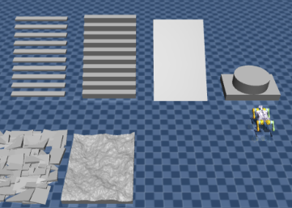

# Procedural Terrain Generation for MuJoCo

>Add your project banner/thumbnail here. Example:


A modular terrain generator for creating diverse simulation environments for legged robotics. This project implements procedural generation of stairs, rough ground, and Perlin noise-based heightfields, designed to improve domain randomization and sim-to-real transfer for locomotion policies.

## Features

- **Stair Generation** — Parametric staircases with configurable width, height, and rotation
- **Rough Ground** — Randomized box obstacles with size, rotation, and spacing variation
- **Perlin Heightfields** — Procedural terrain using Perlin noise for natural-looking elevation
- **Geometry Primitives** — Box, cylinder, sphere, capsule, and more for custom obstacles
- **MuJoCo/MJX Integration** — Outputs valid MuJoCo XML compatible with MJX and Brax

## Project Structure

```
├── terrain_generator.py         # Core terrain generation module
├── terrain_generation_demo.ipynb # Interactive notebook with visualization
├── custom_env.py                 # Brax/MJX environment for Barkour quadruped
├── google_barkour_vb/            # MuJoCo scene assets (required for demo)
├── media/                        # Images and assets
└── requirements.txt
```

> **Note:** The demo uses the Google Barkour benchmark scene. The `google_barkour_vb` folder must be present in the project root to run the full notebook.

## Installation

```bash
git clone https://github.com/nandan-natesan/mujoco-terrain-generation.git
cd mujoco-terrain-generation
pip install -r requirements.txt
```

## Quick Start

**Run the terrain generator directly:**

```bash
python terrain_generator.py
```

This generates `google_barkour_vb/scene_mjx_with_terrain.xml` with sample obstacles.

**Use in your own code:**

```python
from terrain_generator import TerrainGenerator

tg = TerrainGenerator("scene.xml", "scene_with_terrain.xml")
tg.AddBox(position=[1.5, 0.0, 0.1], size=[1, 1.5, 0.2])
tg.AddStairs(init_pos=[1.0, 4.0, 0.0], stair_nums=10)
tg.AddRoughGround(init_pos=[-2.5, 5.0, 0.0], nums=[10, 8])
tg.AddPerlinHeighField(position=[-1.5, 4.0, 0.0], size=[2.0, 1.5])
tg.Save()
```

**Jupyter notebook:** Open `terrain_generation_demo.ipynb` for an interactive walkthrough with simulation visualization.

## Requirements

- Python 3.8+
- MuJoCo 3.x
- mujoco-mjx (for JAX-based simulation)
- numpy, opencv-python, noise (Perlin)

See `requirements.txt` for full dependencies.

## Extending the Generator

Override `CustomTerrain()` in `TerrainGenerator` to add your own procedural components:

```python
def CustomTerrain(self):
    # Add custom obstacles, ramps, platforms, etc.
    self.AddBox(position=[3.0, 0.0, 0.5], size=[2, 2, 0.1])
```

